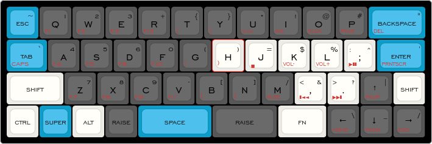

# minivan-kb

My keymaps and layout for my 40% mechanical keyboard (Minivan44).

This is the layout of my daily driver for programming and writing LaTeX and Markdown documents (as well as gaming!). Most layouts I found online attempted to emulate a regular keyboard by mapping numbers to the top row, but I kept making errors with typing numbers and instead opted to implement numbers and symbols as a 'numpad style'.

Numbers are on the left side, `0` sits on the `F` key (with `+` and `-` above and below on the `R` and `V` keys) and the numbers `1-9` are arranges in a 3x3 grid from `Q - C`.

Brackets sit between the `F` and `J` keys on `G` and `H`, `=` sits on the `J` key (with `*` and `/` above and below on `U`and `M`). Symbols on RHS of Keyboard approximately match their corresponding numbers on the LHS.



This layout is available on [Keyboard Layout Editor](http://www.keyboard-layout-editor.com/#/gists/365410b23a30fb67d62e4e6bd7175a9d)


Many thanks to u/evangs on Reddit and everyone involved at https://thevankeyboards.com for launching this keyboard several years ago!


## Editing firmware

Upload the `.json` file to `https://qmk.thevankeyboards.com/` and use the GUI to write keymaps. Once satisfied, build the firmware and download the `.hex` file. To flash this on an Ubuntu PC, I use `dfu-programmer`,

```bash
$ sudo apt install dfu-programmer
```

Put keyboard into flashing mode by pressing button on underside. Check it appears by using

```bash
$ dfu-tool list
```

Erase memory,

```bash
$ sudo dfu-programmer atmega32u4 erase
```

Flash configuration,
```bash
$ sudo dfu-programmer atmega32u4 flash keymap.hex
```

Restart device,
```bash
$ sudo dfu-programmer atmega32u4 start
```

Keyboard should now be ready to go!


## Resources


- [Useful discussion on programming layouts](https://www.reddit.com/r/MechanicalKeyboards/comments/5o6dkd/layouts_for_programming_on_a_minivan/)
- Other interesting layouts: [1](https://imgur.com/gallery/RrfHy), [2](http://www.keyboard-layout-editor.com/#/gists/34112fcba561109d8516e2a64783120c), [3](https://medium.com/@jack_21924/crackle-keyboard-layout-for-special-characters-e4dd04838231), [4](https://imgur.com/a/GPh48), [5](https://i.redd.it/7kppvdk3r2cy.png), [6](https://www.reddit.com/r/MechanicalKeyboards/comments/6qr917/my_bantam_44_build_with_bluetooth_and_some_rick/)
- Keycap colors from PMK: White (WAN), Blue (BCT), Gray (GSF)

